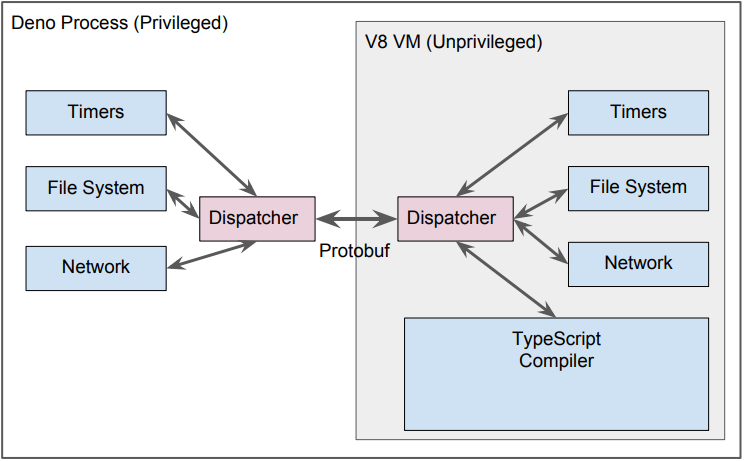

# [deno 如何偿还 node.js 的十大技术债 - 掘金](https://juejin.im/post/5c9355986fb9a070e25a6493)


“Node现在太难用了！”。Node.js之父 Ryan Dahl 去年初要开发一款 JavaScript 互动式数据分析工具时，忍不住抱怨起自己十年前一手创造的技术。

Ryan Dahl 想要设计出一款类似 IPython 的互动式数据科学分析命令行工具，但改用 JavaScript 语言，要让 JavaScript 也可以像 Python 那样，进行各式各样的数据分析、统计计算以及数据视觉化战士。一度离开 Node.js 开发社区的 Rayn Dahl，再次拿起自己发明的 Node.js 来开发这个新的数据分析工具，但是越用越别扭，他开始思考，有什么方法可以改进 Node.js。

Node.js 是他在 2009 年 11 月 8 日时，在 JavaScript 社区欧洲 JSConf 大会上首度发布的，它把浏览器端的 JavaScript 技术，带入了服务器端应用领域。前端网页工程师从来都没想过，自己也可以成为后端工程师，但 Node.js 让前端技术走出了浏览器，前端工程师甚至可以成为全端工程师，Node.js 改变了前端工程师的世界。

从2009年 Ryan Dahl 设计出这个服务器端的 JavaScript 框架，至今已经发展到了第 10 版。而随 Node.js 而生，另一位开发者 Isaac 设计出的 JavaScript 包管理工具 npm，更成了网页开发者必懂得技术，在 npm 的储存库上，注册了超过 60 万个 Node.js 模块，这更让 Node.js 的应用遍及各类开发或软件需求。

## JavaScript是最普及的语言，而Node.js是最受欢迎的框架

根据 Stack OverFlow 在 2018年度的开发者大调查（全球超过 10 万开发者参与），JavaScript 是开发者中最普及的技术，近 7 成开发者都会用，比 HTML 或 CSS 的普及率还要要高，而最多人懂的开发框架排名中，第一名就是 Node.js ，将近5成开发者（49.6％）经常使用，比 2017 年还小幅上升了 2 个百分点，同时使用者还在持续增加，远高于排名第二的 Angular（36.9％），这正是因为 Node.js 是前端和后端工程师都能用的技术。

Node.js 不只是当前的主流技术，也是下一代网页应用架构 Serverless（无服务器）架构的关键技术。负责 Azure Functions 项目的微软资深首席软件工程师 Christopher Anderson 就曾直言，主流无服务器服务商纷纷把宝押在 Node.js，因为看上了 JavaScript 工具的丰富生态，再加上 Node.js 的轻量化、容易分散与水平扩充、各种操作系统都容易运行的特性，将 Node.js 作为无服务器服务优先支持的框架，这也让 Node.js 更适合用于超大规模部署的应用。

Ryan Dahl 自己坦言，从没想到 Node.js 日后会带来这么大的影响。他也将此归功于开发社区的持续改善，才让它越来越成熟。截止到2018年8月，参与 Node.js 的开发者已经超过2千人，十年来的更新发布次数超过 500 次，在 GitHub 上代码的下载次数更是累计超过了10亿次，就连大型科技公司如 PayPal，或顶尖科研机构 NASA 都在使用。

但 Ryan Dahl 在 2012 年开始淡出 Node.js 社区，转而进入 Go、Rust 语言社区，也重回他擅长的数学应用领域，2017 年还申请了 Google 大脑一年的进驻计划，成为 Google 大脑研究团队的一员，担任深度学习工程师，并投入图像处理技术的研究。直到 2018 年 6 月初，就在 Node.js 准备迈入第 10 年之前，JSConf 欧洲大会再次邀请Ryan Dahl 来进行开场演讲。


## 尽管大受欢迎，但 Node.js 仍有十大技术债

原本 Ryan Dahl 打算在 2018 年的 JSConf 演讲中分享自己这款 JavaScript 版的 IPython 互动式数据分析工具，没想到一直开发到 5 月份，这个工具都还不能用。本来要放弃这次演讲的 Ryan Dahl 念头一转，干脆把他重拾 Node.js 后发现的问题拿出来分享，这就是去年引发全球开发社区热烈讨论的那场演讲，题目是 “我在 Node .js 最后悔的 10 件事”。Ryan Dahl 在演讲中坦言，Node.js 有十大设计错误，甚至可说是他的 10 大悔恨（他刻意用Regret 这个词来形容）！

这些让 Ryan Dahl 懊悔不已的错误，包括了没采用 JavaScript 非同步处理的 Promise 对象、低估了安全性的重要性、采用 gyp 来设计 Build 系统、没有听从社区建议改用 FFI 而继续用 gyp，另外，他也觉得 Node.js 过度依赖 npm 功能（内建到 package.json 支持是个错误）、用 require("")来嵌入任意模块简直太容易了、package.json 容易造成错误的模块观念（让开发者误以为同一目录下的文件就是同一模块）、臃肿复杂的node_module设计以及开发社区抱怨已久的下载黑洞问题（下载npm得花上非常久的等待时间）、require("module")功能没有强制要求注名.js扩展名，以及无用的 index.js 设计。

2012年，Ryan Dahl 离开了Node.js社区，他事后解释，Node.js 的发展已经步入正轨，也达到他最初的目标，因而决定离开，但在2018年这场演讲中，他坦言， Node.js 还有大把问题要修复，所以现在他回来了，要来偿还当年的技术债，挽回 Node.js 的设计错误。

Ryan Dahl 的答案是打造一个全新的服务器端 JavaScript 运行环境，也就是 Deno 项目。

Deno从2018年5月在 Github 开源至今年3月，已有超过100名开发者参与，经常贡献代码的核心开发者也有5名。

让Ryan Dahl懊悔不已的 Node.js 十大技术债:

    没用 JavaScript 异步处理的 Promise 对象

    低估了安全的重要性

    使用了 gyp 来设计 Build 系统

    没有听大家的建议提供 FFI 而继续用 gyp

    过度依赖 npm（内建 package.json支持）

    太容易造成 require("任意模块")

    package.json 建立了错误的模块概念（在同一目录下的文件就是同一模块）

    臃肿复杂的 node_module 设计和下载黑洞（往往下载 npm 得花上非常久的时间）

    require("module") 时没有强制加上 .js 扩展名

    无用的 index.js 设计。


## Deno 如何挽回 Node.js 设计上遗留的问题

```ts Deno
(async () => {
    for (let i = 0; i < Deno.args.length; i++) {
        const filename = Deno.args[i]
        const file = await Deno.open(filename)
        await Deno.copy(Deno.stdout, file)
        file.close()
    }
})()
```

这是 Deno 项目的一个范例，是 Unix 系统基本命令 cat 的一个实现。cat 可以从标准输入取得文件， 再逐行把文件内容送出到标准输出上。这个范例反映出 Deno 要将 I/O 抽象化和精简化的意图。

Ryan Dahl 希望通过打造 Deno 这个全新的服务器端 JavaScript 运行环境，来解决 Node.js 的三大问题，包括准确的 I/O 接口、预设安全性（Secure by Default）以及引进一套去中心化的模块系统等，最后一项就是要解决下载过久过慢的老问题。

Ryan Dahl 进一步解释，虽然他所有的时间都是用 C++、Go 或 Rust 这类编译式语言来开发，但是他还是有一些经常要做的事，需要使用动态的脚本程序。例如整理资料、协调测试任务、部署服务器或用户端环境、绘制统计图表、设定构建系统（Build System）的参数或是设计应用雏形等。

可是，这些不同用途的任务，需要切换使用多种不同的脚本语言或工具，如 Bash、Python 或是 Node.js 等才行，相当麻烦。而 2018 年上半年的这个互动式数据分析工具的开发挫折，更让他有一股强烈地念头，能不能有一个通用的脚本工具。




## 打造一款简单、好用的通用脚本工具

Ryan Dahl 在 2018 年 11 月参加台湾年度 JavaScript 开发者大会（JSDC）时，特别提到：“我不喜欢用不同工具来处理不同的事情，我只想要有一个简单，直接可执行，拿了就能用的顺手工具，这正是打造Deno的初衷。”

简单来说，Deno 跟 Node.js 一样都采用了 Chrome 的 JavaScript 引擎 V8，但 Deno 采用了更严格的 JavaScript 语法规范 TypeScript，Deno 等于是一个 TypeScript runtime。第一个版本的 Deno runtime 是用 Go 语言实现的，但是 Ryan Dahl 又重新用 Rust 语言开发了一次 Deno 的 runtime，避免因为重复使用两套垃圾回收器（Go语言一套、V8引擎也内建了一套）而影响效能。另外，Deno runtime 中也内建了 TypeScript 编译器。


## Deno的目标是安全、简洁、单一可执行文件

Deno的设计目标是安全、模块简洁、单一可执行文件（简化封装）等，目前已完成的特色之一，就是可以透过URL 来汇入各种模块，另外预设安全性，要存取实体资源或网络时都需要授权，用户的代码只能在安全的沙箱中执行。为什么他最熟悉的 Go 做不到？因为“动态语言仍有其必要。“他强调，尤其要建立一个适当好用的 I/O 处理流程（pipeline）时，动态脚本语言是不可或缺的工具。

而 JavaScript 就是那个他心中的理想动态语言，但是，Node.js 是一项将近 10 年历史的技术，受限于最初的设计架构，他认为，可以重新用 JavaScript 近几年出现的特性，重新思考 Node. js 的根本设计，包括像是可存取原始内存的标准方法 ArrayBuffers、适合弹性组合的 TypeScript Interfaces，以及新兴的非同步机制 Async 和 Await。Ryan Dahl 把这些新的 JavaScipt 功能，放入了 Deno 中，来设计一款新的服务器端 JavaScript 框架。

但是，这一次，他不想重走 Node.js 的老路，将整个 Web 服务器放进框架，Ryan Dahl 决定打造出一支自给自足功能完整的 runtime 程序，容易带着走，而不是有着一套复杂目录和结构的框架。

而且，打包成 runtime 形式，就可以部署到各种环境中，Ryan Dahl 举例，如果在无服务器服务上部署了Deno，就可指定一个网址，就能启动这个无服务器服务的调用，而不用上传一段代码到无服务器服务平台上执行，也可以部署到边缘运算设备中，来完成小型的数据处理工作。


## 不信任使用者的代码，只能在沙箱执行

另外在安全机制上，Deno 设计了两层权限架构，一个是拥有特权的核心层，另一个是没有特权的用户空间，RyanDahl 解释到，这就像是操作系统的设计一样，不信任使用者的代码，区分出使用者的权限和系统核心的权限等级，使用者的程序，要向使用到关键的资源，必须透过系统调用，由系统核心程序来执行。Deno 也是一样，“不信任用户端的 JavaScript 程序，只能在安全的沙箱中执行。”

所有涉及到敏感资源的处理，如底层文件系统，都需要授权执行，这就是预设安全性的设计，包括网络存取、文件系统写入、环境变量存取、执行等这些敏感的动作，都需要取得授权才能执行。

另外，Deno 的设计还将 I/O 处理抽象化，让 JavaScript 程序不必处理各种不同的输出或输入端配置，改由 runtime 接手，从而无法直接接触实体资源。一来简化各种不同的 I/O 存取方式，不论是本地或远 I/O，都是同样的 read 和 write 指令就可以搞定，二来也可以强化安全性。

另外，Deno 还借鉴了不少 Go 语言的特性，例如 Deno 的 copy() 就参考了 Go 语言的 io.Copy()， BufReader() 也参考了 Go 语言的 bufio.Reader 设计等，还有不少测试机制、文件等，Ryan Dahl 也都参考了他熟悉的Go语言。


## 指定URL，就能嵌入第三方函数库

Deno 第三项设计目标是要打造一个去中心化的模块系统，Ryan Dahl 的设计是，Deno 可以像 JavaScript 一样，通过 URL 网址来嵌入外部的第三方函数库。除此之外，Deno和Rust语言也有不少整合，甚至改用Rust来实作Deno之后，Ryan Dahl透露，将会建立一个桥接机制，让Deno可以很容易地运用Rust中的函数库。

不过他坦言，嵌入外部的第三方函数库的机制，也是 Deno 项目发布后，人们询问最多、也最担心的功能，担心透过 URL 来引入外部函数库后，容易引发安全问题或是中间人攻击等问题。“这就是为什么 Deno 要采取预设安全性的设计的原因，来隔绝来自外部第三方代码的威胁。”

另外，通过 URL 连结到第三方函数库时，Deno 会通过缓存，在本地环境生成一份第三方函数库，第二次再调用到同样的URL时就不需再次下载了，以此来加快执行速度。甚至这个通过外部 URL 来引用函数库的功能，还可以指定版本，就算是改版了，还是可以指向旧版。当然 Ryan Dahl 强调，所有存取外部网络或下载写入到本地文件的动作，都需要取得授权才能执行。


## 未来会支持 WebGL，Deno 就能调用 GPU 资源

Deno 还有一个与 Node.js 最大的差异，就是未来会支持机器学习。Ryan Dahl 透露，他们正在开发一个数值计算类的外挂模块，最重要的就是要能支持 GPU，这也是机器学习模块最需要的功能。“Deno未来将会原生支持 WebGL，就可以让 JavaScipt 程序调用 GPU 的资源。这是他打造 Deno 的目标之一。”甚至，Ryan Dahl 预告，未来说不定可以把 TensorFlow JS 放上 Deno 来执行，因为 TensorFlow JS 用的也是 WebGL。

## Deno未来将瞄准小型机器学习的推理需求

不同于 Nvidia的CUDA 可以用来调度多颗 GPU 资源进行复杂的机器学习训练工作，Ryan Dahl 解释，Deno 想要提供的是简单够用的机器学习能力，可以用来满足只有单颗 GPU，而且是小型或是只需要推理的计算需求，支持WebGL 已经够用了。
